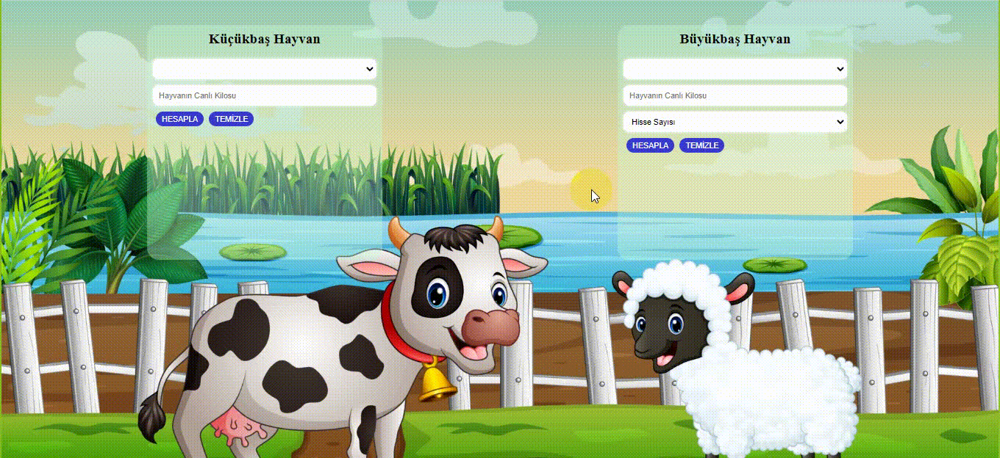

# Kurban Robotu Projesi

Bu proje, kullanıcının büyükbaş veya küçükbaş olarak belirttiği hayvanın cinsini ve canlı kilosunu girerek karkas et miktarını ve ortalama fiyatını hesaplayan bir web uygulamasıdır.

## Kullanıcı Arayüzü

Kullanıcı arayüzü basit bir tasarıma sahiptir ve aşağıdaki bileşenleri içerir:

- **Hayvan Türü**: Büyükbaş veya küçükbaş olarak hayvanın türünü seçmek için bir açılır menü bulunmaktadır.
- **Canlı Kilo**: Hayvanın canlı kilosunu girmek için bir metin kutusu bulunmaktadır.
- **Hesapla Butonu**: Kullanıcı girdilerini tamamladıktan sonra hesaplamayı başlatmak için bu butona tıklanmalıdır.
- **Sonuç**: Hesaplama sonucunda elde edilen karkas et miktarı, ortalama fiyatı ve hisse bedeli kullanıcıya gösterilir.
- **Temizle**: Temizle buttonu ile girilen veriler temizlenmektedir.

## Teknolojiler

Bu proje aşağıdaki teknolojiler kullanılarak oluşturulmuştur:

- HTML
- CSS
- JavaScript

## Katkıda Bulunma

Eğer bu projeyi geliştirmek veya katkıda bulunmak isterseniz, aşağıdaki adımları takip edebilirsiniz:

1. Depoyu Klonlama: Bu projenin bir kopyasını bilgisayarınıza klonlayın.
2. Kod Düzenlemesi: Kullanıcı arayüzünü geliştirmek veya ek işlevler eklemek için HTML, CSS ve JavaScript dosyalarını düzenleyin.

# Kurban-robot-projesi
